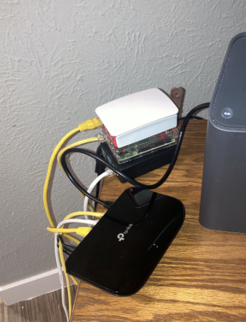
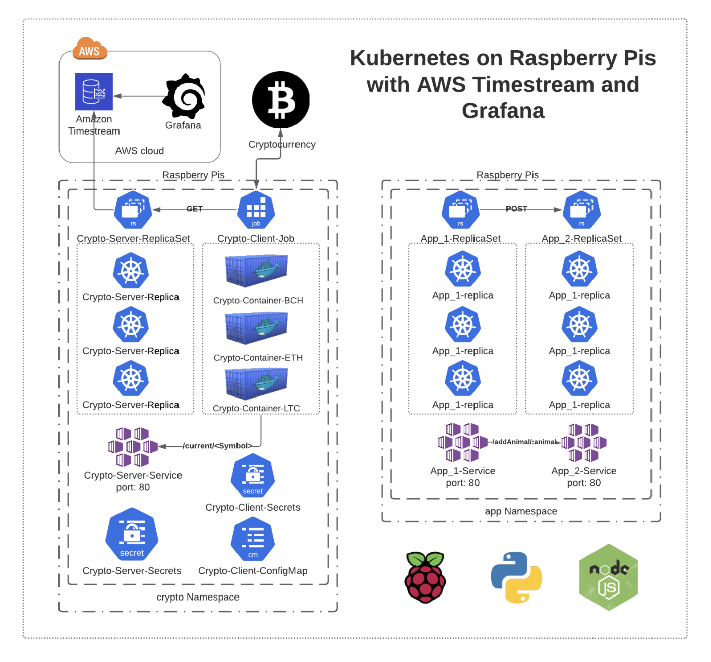

# Kubernetes on Raspberry Pis with AWS Timestream and Grafana

In this project, we build and deploy a Kubernetes Cluster on a fleet of Raspberry Pis, store Cryptocurrency data in AWS Timestream, and visualize the data in Grafana.

- Subscribe to the AWSMeetupGroup YouTube Channel: https://www.youtube.com/channel/UCG3Si_vP2tijvvyE5xr7lbg

- Slides: [https://docs.google.com/presentation/d/1UA9DZpcFKJ0k_DWdUSXU0P6iH1OJUMrJhgO46yRZv18/edit?usp=sharing](https://docs.google.com/presentation/d/1UA9DZpcFKJ0k_DWdUSXU0P6iH1OJUMrJhgO46yRZv18/edit?usp=sharing)

- LiveStream: [https://youtu.be/6uumpFn2RJ0](https://youtu.be/6uumpFn2RJ0)

<p align="center">
  
</p>

## Hardware Requirements

What we used:

- 3 [Raspberry Pis](https://www.amazon.com/CanaKit-Raspberry-Premium-Clear-Supply/dp/B07BC7BMHY/ref=sr_1_5?dchild=1&keywords=raspberry+pi&qid=1612839353&sr=8-5)
- 1 [Gigabit Switch](https://www.amazon.com/NETGEAR-8-Port-Gigabit-Ethernet-Unmanaged/dp/B07PFYM5MZ/ref=sr_1_3?crid=2EB4V034S2619&dchild=1&keywords=gigabit+switch&qid=1612839423&sprefix=gigabit%2Caps%2C246&sr=8-3)
- 3 [SD Cards](https://www.amazon.com/Genuine-SanDisk-Memory-SDSDUN-016G-G46-Version/dp/B017HPZKLO/ref=sr_1_8?dchild=1&keywords=sd+card&qid=1612839509&sr=8-8) (16 GB of storage minimum)
- 3 [Ethernet Cables](https://www.amazon.com/Ethernet-Outdoor-Connector-Weatherproof-Resistant/dp/B07QLXC6QR/ref=sr_1_3?crid=1B70X09KYD6UD&dchild=1&keywords=ethernet+cable&qid=1612839582&sprefix=etherne%2Caps%2C209&sr=8-3)

- 1 [SD Card Reader](https://www.amazon.com/gp/slredirect/picassoRedirect.html/ref=pa_sp_atf_aps_sr_pg1_1?ie=UTF8&adId=A0587881115F3CYYG2ID5&url=%2FAdapter-MacBook-USB-C-Reader-Thunderbolt%2Fdp%2FB07Z4RF1D3%2Fref%3Dsr_1_1_sspa%3Fdchild%3D1%26keywords%3Dmacbook%2Bair%2Bsd%2Bcard%2Badapter%26qid%3D1612840356%26sr%3D8-1-spons%26psc%3D1&qualifier=1612840355&id=6582865721457303&widgetName=sp_atf)

<p align="center">
  
</p>

# Setup Instructions

We're going to install and setup a Kubernetes Cluster on a fleet of Raspberry Pis and deploy an application in the Cluster.

## Install Hypriot OS

We need to insert SD Card into SD Card Reader and install the Hypriot OS on the SD card.

Install [flash command line tool](https://github.com/hypriot/flash)

```
curl -LO https://github.com/hypriot/flash/releases/download/2.7.0/flash
chmod +x flash
sudo mv flash /usr/local/bin/flash
```

After inserting the SD card into the SD Card reader you can view it with

- `diskutil list` (It should be the last disk)

(Optional WiFi Setup):

- Update the `/setup/wifi.yaml` file to contain your WiFi name and Wgot itiFi password. Also, update the "hostname" field to be whatever you want. I have mine set to "nodemaster".

Now we can Flash the Hypriot OS on the SD Card.

`flash --hostname <SAME AS THE HOSTNAME IN /setup/wifi.yaml> --userdata /setup/wifi.yaml https://github.com/hypriot/image-builder-rpi/releases/download/v1.4.0/hypriotos-rpi-v1.4.0.img.zip`

Repeat this for every SD Card/Raspberry Pi. Make sure to change the hostname for each one. (e.g. "node01", "node02", "nodemaster")

## Install Kubernetes

Now that you have the Hypriot OS installed and inserted the SD cards back into the Raspberry Pis you can SSH into each Pis and install Kubernetes.

On your machine you can SSH into the Raspberry Pis as long as you're on the same network.

- `ssh pirate@<HOSTNAME>.local`

The password `hypriot` will grant you access.

The installation requires root permissions:

- `sudo su -`

To install Kubernetes you first need to trust the Kubernetes APT key and official APT Kubernetes repository on every node:

```
$ curl -s https://packages.cloud.google.com/apt/doc/apt-key.gpg | apt-key add -

$ echo "deb http://apt.kubernetes.io/ kubernetes-xenial main" > /etc/apt/sources.list.d/kubernetes.list
```

Then install `kubeadm` on every node:

`apt-get update && apt-get install -y kubeadm`

## Configure Kubernetes Master Node

We need to init the Kubernetes Master node and install a CNI for internal networking. We're going to use [Flannel](https://github.com/coreos/flannel) for this.

First Initialize the Master Node:

- `sudo kubeadm init --pod-network-cidr=10.244.0.0/16`
  (Note: Don't change the cidr range. Flannel uses this Range to establish networking.)

After running this command `kubeadm` will output a command for you to run in every node. Save this command, we need to run some other commands before we run this to properly establish internal networking.
(e.g. `kubeadm join --token <token> <IP>:6443`)

Setup your `kube/config`:

```
sudo cp /etc/kubernetes/admin.conf $HOME/
sudo chown $(id -u):$(id -g) $HOME/admin.conf
export KUBECONFIG=$HOME/admin.conf
```

Then install Flannel:

- `kubectl apply -f https://github.com/coreos/flannel/raw/master/Documentation/kube-flannel.yml`

Check the status of the install by running:

- `kubectl get po -A` (This will return all pods in every namespace)

If your installation is successful then, as a normal user, you can run the kubeadm join command from earlier in the other two nodes and have them join the Master Node's Kubernetes cluster.

- `sudo kubeadm join --token <token> <ip>:6443`

You can check the health of every node by running

- `kubectl get nodes` (You should see the other two nodes running in the cluster for a total of 3 nodes)

## Remove taint on Master Node

Since we're using Raspberry Pis we want to utilize all the computing power available to use. We can remove the restriction, "taint", from the Master Node by running:

- `kubectl taint nodes --all node-role.kubernetes.io/master-`

## Setup KubeConfig on Local Machine

To make installing applications and working with the K8s cluster on the Raspberry Pis easier we're going to add the Kube Context from the Pis Cluster to our local machine (Mac).

Make sure to install `kubectl` first.

- `brew install kubectl`

Inside of the Raspberry Pis shell run:

- `cp ~/.kube/config`

Copy it and on your Mac, in a separate terminal, run:

- `echo "<KUBE CONFIG CONTENT>" > ~/.kube/config`

Then select that Kube context. For me it was:

- `kubectl config use-context kubernetes-admin@kubernetes`

You should see "Switched to context "kubernetes-admin@kubernetes"."

## Deploy Applications on Raspberry Pi Kubernetes Cluster

The final Step of this tutorial is to install an application on the cluster. For this we're going to use the "animals" application inside the `/apps` directory.

The "animals" application is two separate applications. 1 application, app_1, calls the other application, app_2, and the second application adds a new animal to an array inside the container. For example, the endpoints are `/listAnimals`, in app_1, and `/addAnimal/:newAnimal`, in app_2.

So in App_1 you request `/addAnimal/lion` and then go to App_2 `/listAnimals` it will return an array that contains "lion". This is added to a local array inside the application.

In a new terminal window change directories into the `/k8s/resources` directory:

- `cd k8s/resources`

Now we can install the application by running:

- `kubectl apply -f app.yaml`

You can watch the status of this by running:

- `kubectl get po -n app -w` (This will get the pods in the namespace "app" and watch the status of the pods)

You can also view the services in the namespace:

- `kubectl get svc -n app` or `kubectl get svc -A` (to view all services in every namespace)

If you hit any errors you can debug them by running:

- `kubectl describe po <NANE OF POD FROM "kubectl get po -n app"> -n app` (This will describe the pod)

- `kubectl logs <NANE OF POD FROM "kubectl get po -n app"> -n app` (This will show the logs from the container itself)

### Testing the application

Great! We should now have a basic application inside of our Kubernetes Cluster running on Raspberry Pis.

Now, we need to test the application. We can do this in an easy way using a tool called [kubefwd](https://github.com/txn2/kubefwd). Kubefwd will port-forward all of the services in a specified namespace. For this application we have two services: "app-1-service", "app-2-service" both listening on port 80.

Install `kubefwd`:

- `brew install txn2/tap/kubefwd`

Make sure you are using the `kubernetes-admin@kubernetes` context by running:

- `kubectl config current-context`

Next, port forward the services and test the application:

- `sudo kubefwd svc -n app`

You should see two services port-forwarded: "app-1-service:80" and "app-2-service:80".

Now you can go to `http://app-1-service:80/addAnimal/lion` to add an animal to the list of animals.

Then go to `http://app-2-service:80/listAnimals` to view the newly added animal.

## Next steps

Now that you have a basic application running on a Raspberry Pis you can play around with the setup and the code to learn more about Kubernetes. Make sure, if you haven't already, to checkout the LiveStream we did on this: https://youtu.be/6uumpFn2RJ0.

Make sure to see the next LiveSteam we do on Kubernetes where we build onto the Crypto application, deploy onto AWS EKS, and monitor the health of our Cluster with Grafana and Prometheus.

Next Meetup: https://www.meetup.com/AWSMeetupGroup/events/275161155/

LiveStream: https://youtu.be/dDyIxWlx4Qs

# Final Architecture:

<p align="center">
  
</p>
