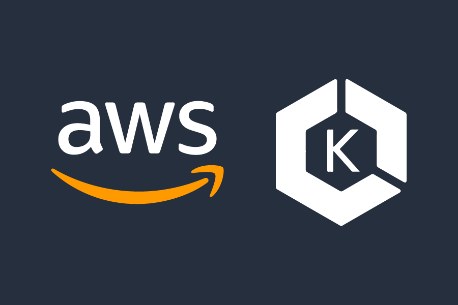

# Intro to Kubernetes on AWS with Grafana and Prometheus

This workshop is intended to be a thorough tutorial on how to build an application in EKS from start to finish, and explain the various resources Kubernetes has to offer.

- Subscribe to the AWSMeetupGroup YouTube Channel: https://www.youtube.com/channel/UCG3Si_vP2tijvvyE5xr7lbg

  

